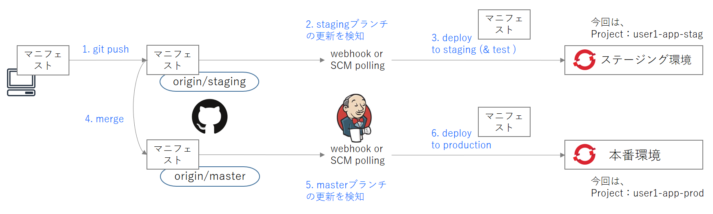

# openshift-pipeline-practice-branch-deploy

Jenkinsのジョブを利用してリポジトリ内のマニフェストをOpenShift上にデプロイする。さらに、ブランチによってデプロイ先を分ける。



### overview

##### ステージング環境へのデプロイ

1. ローカルリポジトリでマニフェストを commit し、github の staging ブランチへpushする

2. github の staging ブランチ上のマニフェストが更新され、Jenkins側からのSCMポーリングによりstagingブランチの更新を検知する

3. Jenkins のジョブが実行されてステージング環境へマニフェストをデプロイする

   ⇒ここまでは承認なく自動でデプロイを行うケースが多い

   

##### 本番環境へのデプロイ

4. staging ブランチを master ブランチへ mergeする（PRの承認など人の手によるケースが多い）

5. github の master ブランチ上のマニフェストが更新され、Jenkins側からのSCMポーリングによりmasterブランチの更新を検知する

6. Jenkins のジョブが実行されて本番環境へマニフェストをデプロイする


### 環境

- OpenShift CodeReady Containers

  ```
  $ crc version
  crc version: 1.9.0+a68b5e0
  OpenShift version: 4.3.10 (embedded in binary)
  ```


### 動作確認

##### 初期状態

```
//ステージング環境、本番環境どちらも nginx:1.11
$ oc get pod --all-namespaces
/snip/
user1-app-prod                                          nginx-68b47b4d58-c8cws                                            1/1     Running     0          22m
user1-app-stag                                          nginx-68b47b4d58-wzvr9                                            1/1     Running     0          41m
//本番環境
$ oc describe pod nginx-68b47b4d58-c8cws -n user1-app-prod | grep "Image:"
    Image:          nginx:1.11
//ステージング環境
$ oc describe pod nginx-68b47b4d58-wzvr9 -n user1-app-stag | grep "Image:"
    Image:          nginx:1.11
```

##### ステージング環境へデプロイ

```
//ローカルPCでstagingブランチにcheckoutしてマニフェストのimageをnginx:1.11→nginx:1.12へ更新。commitしてからgithubのstagingブランチへpushする。

$ git checkout staging
$ vi template-deploy.yaml 　//imageをnginx:1.11→nginx:1.12へ更新
$ git add template-deploy.yaml
$ git commit -m "change image nginx:1.12"
$ git push origin staging

//Jenkinsジョブのコンソールログ（抜粋）
//staging deployのみが実行され、production deployの処理はskipされている
Started by an SCM change
staging deploy
Stage "production deploy" skipped due to when conditional
Finished: SUCCESS

//デプロイ結果
//ステージング環境はマニフェストがデプロイされてnginx:1.11→nginx:1.12へupdateされている
$ oc get pod --all-namespaces
/snip/
user1-app-prod                                          nginx-68b47b4d58-c8cws                                            1/1     Running     0          39m
user1-app-stag                                          nginx-7856959c59-wtl5s                                            1/1     Running     0          14s
//本番環境
$ oc describe pod nginx-68b47b4d58-c8cws -n user1-app-prod | grep "Image:"
    Image:          nginx:1.11
//ステージング環境
$ oc describe pod nginx-7856959c59-wtl5s -n user1-app-stag | grep "Image:"
    Image:          nginx:1.12
```

##### 本番環境へデプロイ

```
//githubの画面でPull Request → Create Pull Request → Merge pull request → Confirm merge によりmerge commitする。これによりstagingブランチのファイルがmasterブランチへmergeされる。

//Jenkinsジョブのコンソールログ（抜粋）
//今度はstaging deployはskipされ、production deployの処理が実行されている
Started by an SCM change
Stage "staging deploy" skipped due to when conditional
production deploy
Finished: SUCCESS

//デプロイ結果
//本番環境にマニフェストがデプロイされてnginx:1.11→nginx:1.12へupdateされた
$ oc get pod --all-namespaces
/snip/
user1-app-prod                                          nginx-7856959c59-wbln9                                            1/1     Running       0          7s
user1-app-stag                                          nginx-7856959c59-wtl5s                                            1/1     Running       0          13m
//本番環境
$ oc describe pod nginx-7856959c59-wbln9 -n user1-app-prod | grep "Image:"
    Image:          nginx:1.12
//ステージング環境
$ oc describe pod nginx-7856959c59-wtl5s -n user1-app-stag | grep "Image:"
    Image:          nginx:1.12
```

